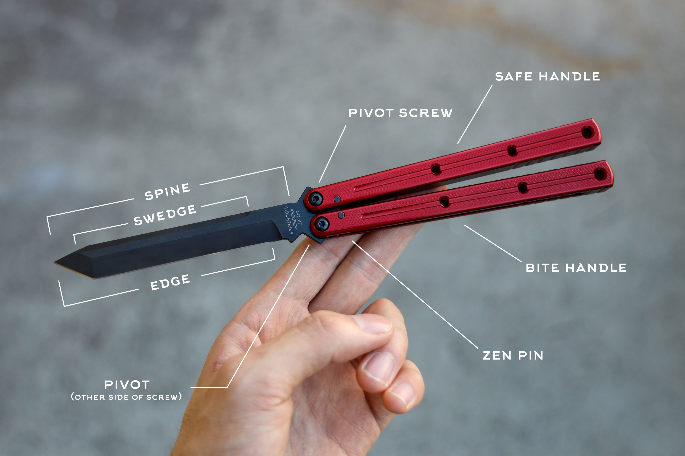

# Parts of Balisong
## Handles
---
- Bite handle: The handle that closes over the edge of the blade.
- Safe handle: The handle that closes over the spine of the blade.
- Jimping: Ridges or slots usually found on the sides of the handle ends to improve grip while doing ladder tricks.

### Handle Construction
- Channel: A handle construction made from a single piece of material per handle with a channel running down it for the blade to fit into.
- Sandwich: A handle construction made from at least two pieces of material with a spacer at the end to leave a gap for the blade to fit into.
- Chanwich: A mix between channel and sandwich - two pieces of material, like sandwich, but they fit together to look and act like channel.

## Blade
---
- Spine: The dull side of the blade.
- Tang: The bottom of the blade: opposite side of the tip.
- Swedge: The unsharpened, angled portion on the spine of the blade near the tip.
- Bevel: The angled surface on the blade that leads down to the cutting edge.
- Cutting Edge: The sharpened part of the blade that makes contact with the material being cut.
- Sharpening Choil: A small unsharpened notch at the heel of a knife blade. This provides a clean stop for a sharpened edge.

### Stop System
- Zen Pins: A pin that goes through the handles near the pivots that limit the rotation range of the handles.
- Tang Pins: A pin going through the blade (usually two equidistant from the pivots) to limit the rotation range of the handles.
- Pinless: A knife that has neither zen or tang pins (often leads to handle slap).

### Pivot System
- Bushings: A metal cylinder that rests between the pivots and the blade: a pivot system.
- Washers: A thin disk that rests between the handles and the blade around the pivots.
- Bearings: Metal balls that sit between the blade and the handle, giving minimal resistance.

### Tolerances
- Tap: When the blade hits the side of the inside handles and makes a tapping sound.
- Binding: When a full crank of screws on a bushing balisong causes the handle motion to seize to any degree.
- Play: The ability for the handles to move laterally due to tolerances.
- Handle Slap: When the handles hit each other.
- Blade Rub: When the blade edge hits any part of the handles, causing damage. 
- QC (quality control): Variance in tolerances, sharpness, finish and other factors between balisongs of the same design and maker.
